# Finly - Gestão Financeira Inteligente 🚀💰

**Finly** é uma aplicação Android moderna, segura e intuitiva desenhada para ajudar utilizadores a ter um controlo total sobre as suas finanças pessoais. Com um design premium no padrão Material Design 3 e funcionalidades avançadas de sincronização em nuvem, o Finly transforma a gestão de gastos numa experiência simples e organizada.

---

## ✨ Funcionalidades Principais

*   **📊 Dashboards Visuais:** Gráficos circulares (Donut) para resumo mensal, cartões dinâmicos por categoria e gráficos de barras para evolução anual de rendas e despesas.
*   **🎯 Destaque Visual do Período:** Seleção compacta de mês e ano com destaque proeminente no cabeçalho para rápida identificação do filtro ativo.
*   **🔔 Notificações Inteligentes de Vencimento:** Alertas automáticos via **WorkManager** sobre contas a vencer (hoje, nos próximos dias ou em atraso recente) com atalho direto ao resumo.
*   **🔄 Sincronização em Tempo Real:** Integração total com **Firebase Firestore**, garantindo que transações, metas de poupança e categorias personalizadas sejam atualizadas instantaneamente em tempo real entre todos os telemóveis ligados à mesma conta.
*   **🏷️ Gestão de Categorias Personalizadas:** Crie e gira as suas próprias categorias. Ao eliminar uma categoria em utilização, as transações associadas são reatribuídas em segurança para a categoria **"Geral"**.
*   **🔐 Autenticação & Modo Convidado 100% Privado:** Sistema de login/registo via Firebase Auth. O modo "Convidado" guarda dados exclusivamente locais (Room DB), sem qualquer envio para a nuvem.
*   **📅 Recorrência Inteligente:** Registe contas fixas uma única vez e o sistema gera automaticamente as transações para os meses futuros com controlo de parcelas (ex: `1/3`).
*   **📄 Exportação PDF Avançada:** Gere relatórios profissionais em PDF com o logótipo em alta definição, tabela de **Resumo de Despesas por Categoria (%)** e tabelas separadas para **Rendas (Entradas)** e **Despesas (Saídas)** ordenadas cronologicamente por **Data de Vencimento**.
*   **📈 Evolução Anual:** Painel exclusivo para comparar o desempenho financeiro mês a mês ao longo do ano.
*   **🌓 Modo Escuro Nativo:** Interface totalmente adaptada para os modos Light e Dark com alteração fluida de tema.
*   **📱 UX & Teclado Fluido:** Ajuste dinâmico da interface ao abrir o teclado (`SOFT_INPUT_ADJUST_RESIZE`) e recolha automática ao adicionar dados.

---

## 📸 Demonstração Visual (Screenshots)

### 🔐 Autenticação & Entrada
| Login | Registo de Conta | Modo Convidado |
| :---: | :---: | :---: |
| 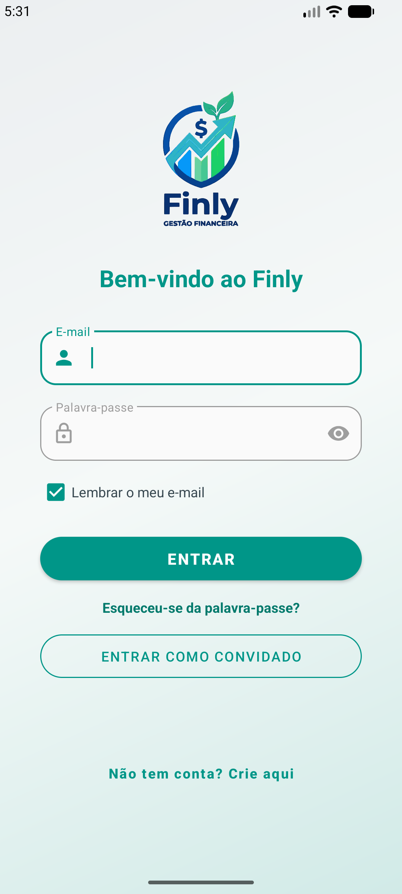 |  |  |

### 📝 Gestão & Adição de Transações
| Listagem Detalhada | Nova Transação | Detalhes da Transação |
| :---: | :---: | :---: |
| 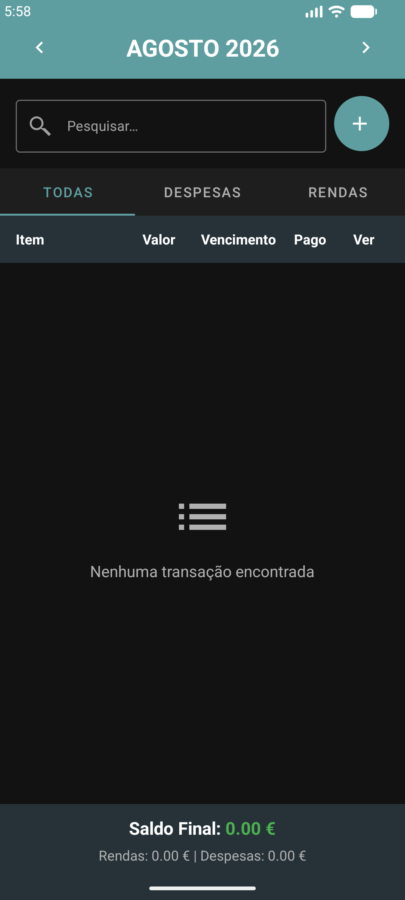 | 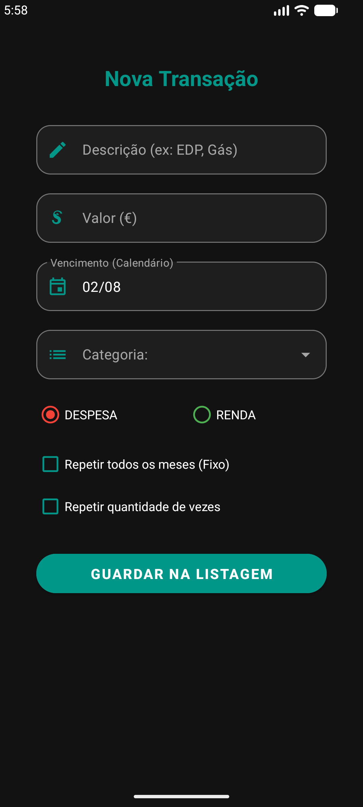 | 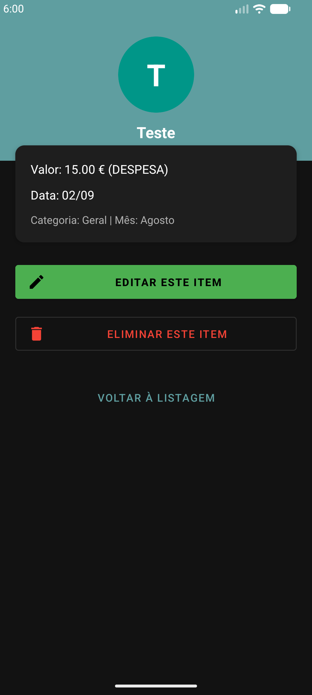 |

### ⚙️ Edição & Eliminação Inteligente
| Editar Item | Eliminar Item | Eliminar Recorrência |
| :---: | :---: | :---: |
| 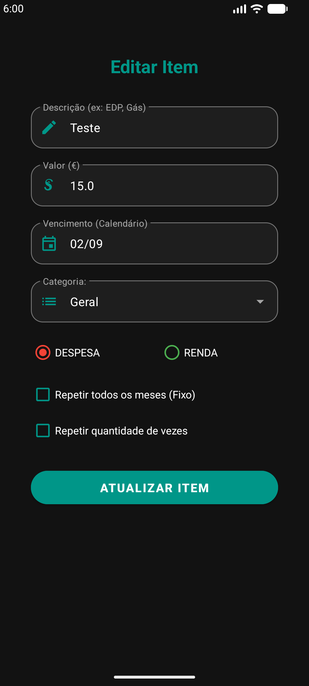 | 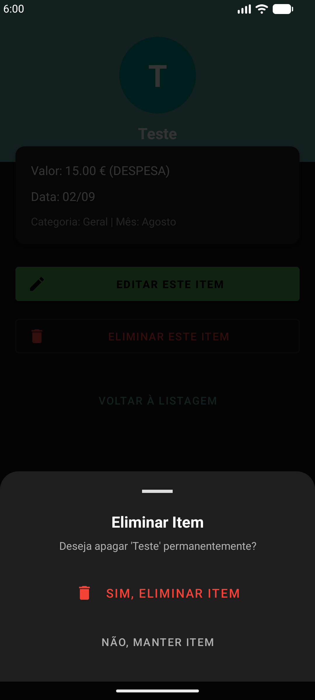 | 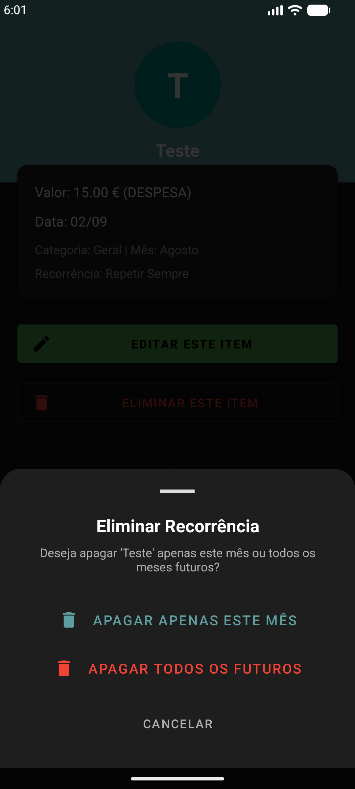 |

### 📊 Dashboards & Relatórios
| Resumo com Gráfico | Lista por Categorias | Evolução Anual (Barras) |
| :---: | :---: | :---: |
| 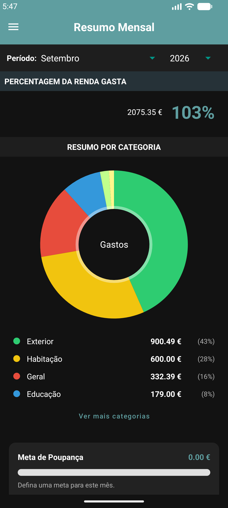 | 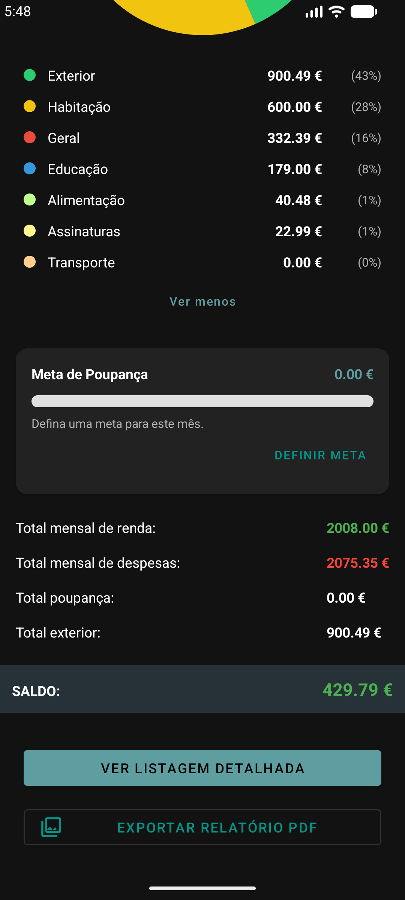 | 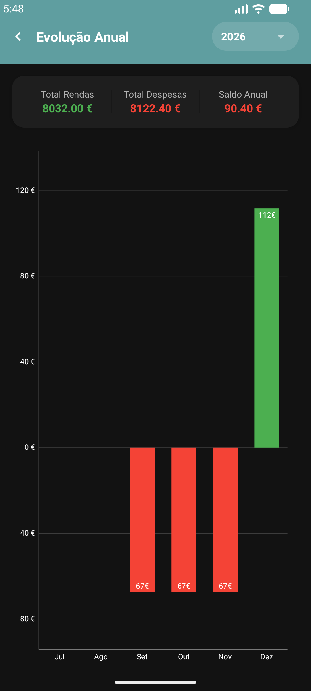 |

### 📖 Perfil & Guia do Utilizador
| O Meu Perfil | Editar Perfil | Guia do Utilizador |
| :---: | :---: | :---: |
| 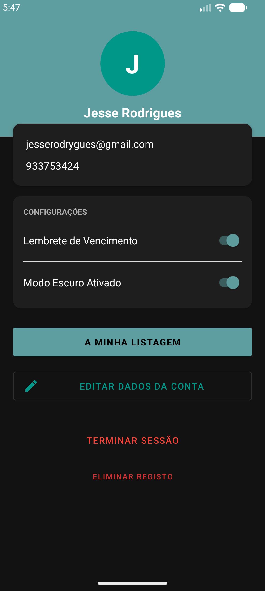 | 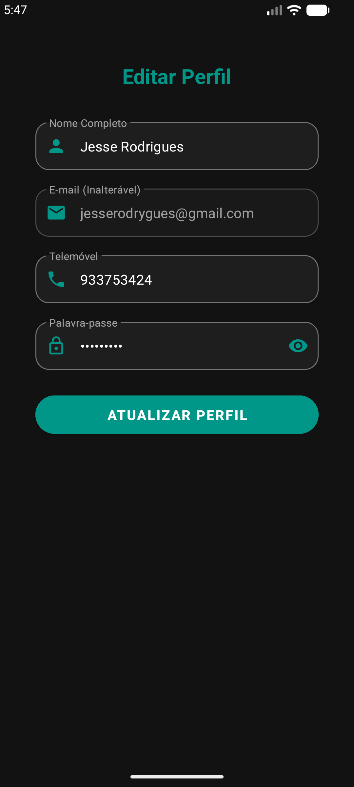 |  |

---

## 🛠️ Tecnologias Utilizadas

O projeto foi construído com as melhores práticas de desenvolvimento Android:

*   **Linguagem:** [Kotlin](https://kotlinlang.org/) (100% Nativo)
*   **Arquitetura:** MVVM (Model-View-ViewModel) com Coroutines & Flow.
*   **Base de Dados Local:** [Room Database](https://developer.android.com/training/data-storage/room) para persistência offline rápida.
*   **Backend & Nuvem:** [Firebase](https://firebase.google.com/) (Firestore em tempo real, Auth).
*   **Notificações & Background:** [WorkManager](https://developer.android.com/topic/libraries/architecture/workmanager) para agendamento de tarefas e notificações nativas.
*   **Gráficos & PDFs:** [MPAndroidChart](https://github.com/PhilJay/MPAndroidChart) e API nativa `PdfDocument` com renderização vetorial de alta definição.
*   **UI/UX:** Material Design 3, View Binding, Edge-to-Edge API, Inset Listeners.

---

## 🚀 Como Executar o Projeto

1.  Clone este repositório:
    ```bash
    git clone https://github.com/Jrodrygues/Finly-Gestao-Financeira.git
    ```
2.  Abra o projeto no **Android Studio**.
3.  Configure o seu ficheiro `google-services.json` do Firebase na pasta `app/`.
4.  Sincronize o Gradle e execute no seu emulador ou dispositivo físico.

---

## 📄 Licença

Este projeto está sob a licença MIT - veja o ficheiro [LICENSE](LICENSE) para detalhes.

---

## ✍️ Autor

Desenvolvido com ❤️ por **Jesse Rodrigues**. 

---
*Finly - O seu futuro financeiro começa aqui.*
