# Finly - Gestão Financeira Inteligente 🚀💰

**Finly** é uma aplicação Android moderna, segura e intuitiva desenhada para ajudar utilizadores a ter um controlo total sobre as suas finanças pessoais. Com um design premium no padrão Material Design 3, suporte multi-idioma nativo e funcionalidades avançadas de sincronização em nuvem, o Finly transforma a gestão de gastos numa experiência simples e organizada.

---

## ✨ Funcionalidades Principais

*   **⚡ Arquitetura Reativa & Padrão Repository (Flow & ViewModels):** Reatividade em tempo real no Room DB e Firebase Firestore via `FinanceiroRepository`, `MainViewModel` e `ResumoViewModel`. Alterações locais ou sincronizadas da nuvem atualizam a interface instantaneamente.
*   **👆 Gestos Rápidos de Deslizar (*Swipe-to-Action*):** Deslize qualquer conta da lista para a direita (👉 Verde) para **Marcar como Paga/Pendente** ou para a esquerda (👈 Vermelho) para **Eliminar** com validação prévia de recorrência (eliminar apenas o mês ou todas as ocorrências).
*   **🔍 Pesquisa Inteligente e Filtro em Tempo Real:** Pesquise contas pelo **Nome do Item** ou pela **Categoria** com filtragem instantânea enquanto digita.
*   **🎯 Teto Orçamental por Categoria (*Category Budgeting*):** Defina limites de gastos mensais para cada categoria (ex: *Restaurantes: 150 €*, *Lazer: 100 €*). Exibição visual (`120 € / 150 €`) com cores dinâmicas (🟢 Verde / 🟡 Laranja / 🔴 Vermelho com alerta `⚠️`), avisos de estouro e botão dedicado de **Remover Teto** em 1 toque.
*   **🔮 Projeção Financeira de Saldo Futuro (+3 e +6 Meses):** Card de previsão no ecrã de Resumo estimando o saldo futuro para os próximos 3 e 6 meses com alinhamento otimizado à direita e esquerda.
*   **💾 Backup Local Encriptado (`.finly`):** Exporte e importe cópias de segurança encriptadas (AES) diretamente do menu lateral (Hambúrguer) para guardar dados no telemóvel ou restaurar transações a qualquer momento.
*   **⏰ Horário Personalizável das Notificações:** Escolha no Perfil/Definições a hora exata para receber os lembretes diários de vencimento de contas, com navegação direta da notificação para o ecrã de listagem de transações e eliminação automática da notificação ao abrir.
*   **🌐 Suporte Multi-Idioma Nativo (Per-App Language Preferences):** Suporte completo para 4 variantes linguísticas (`Português (Portugal)`, `Português (Brasil)`, `English (US)` e `Español`). Troca dinâmica de idioma em 1 toque no Perfil com integração nativa às preferências do Android 13+.
*   **🌍 Sistema Multi-Moeda Dinâmico & Onboarding:** Escolha da moeda principal (`€ EUR` / `R$ BRL`), alternância em 1 toque no perfil, máscara automática de centavos (`MoneyTextWatcher`), suporte em todos os ecrãs, gráficos e relatórios (PDF/CSV) e sincronização instantânea em tempo real entre dispositivos.
*   **📊 Dashboards Visuais & Inteligência Financeira:** Gráficos circulares (Donut) para resumo mensal, alertas visuais quando despesas superam 100% da renda e card dedicado de **Previsão de Fim de Mês** (`🟢 No Verde` / `🔴 No Vermelho`).
*   **📤 Exportação Multiformato Unificada (PDF, CSV & Backup .finly):** Modal no menu lateral com geração de relatórios em PDF (vetorial com gráficos e tabelas), CSV (estruturado para Excel/Sheets) e ficheiros de cópia de segurança `.finly`.
*   **🔄 Sincronização em Tempo Real:** Integração total com **Firebase Firestore**, garantindo que transações, metas de poupança, moeda e categorias personalizadas sejam atualizadas em tempo real entre todos os dispositivos ligados à mesma conta.
*   **🔐 Segurança de Nível Bancário & Modo Convidado Flexível:** Autenticação encriptada via **Firebase Auth** e proteção por impressão digital/PIN via `BiometricPrompt`. O modo "Convidado" guarda dados exclusivamente locais (Room DB), permitindo acesso ao ecrã de perfil e Modo Escuro (predefinido como claro), com restrições inteligentes em ações de conta e exportação.
*   **🔄 Recorrência Inteligente & Escopo de Edição:** Registe contas fixas ("Repetir Sempre") ou parceladas. Escolha se deseja alterar/eliminar apenas o mês selecionado ou este mês e todos os meses futuros.
*   **📈 Evolução Anual:** Painel exclusivo para comparar o desempenho financeiro mês a mês ao longo do ano com gráfico de barras e balanço consolidado.
*   **🌓 Modo Escuro Nativo:** Interface totalmente adaptada para os modos Light e Dark com alteração fluida de tema.

---

## 📸 Demonstração Visual (Screenshots)

### 🔐 Autenticação & Entrada
| 01. Login | 02. Registo de Conta |
| :---: | :---: |
| 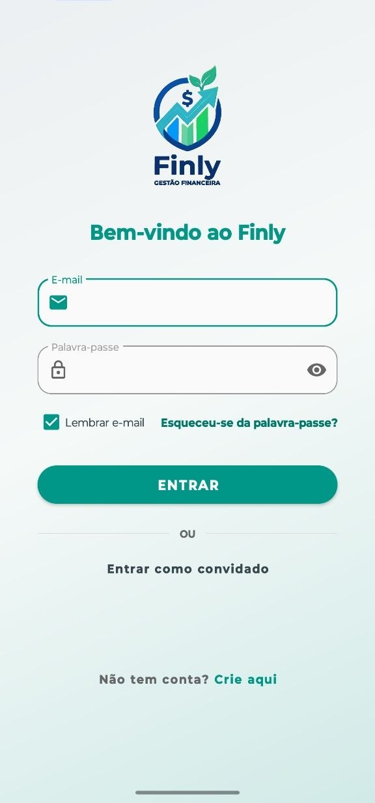 | 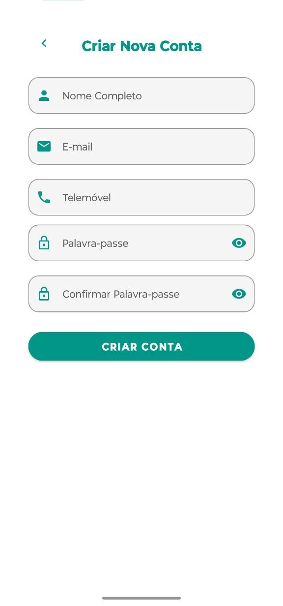 |

### 📊 Resumo & Perfil
| 03. Resumo Financeiro & Metas | 04. Perfil & Status Premium | 05. Perfil & Configurações |
| :---: | :---: | :---: |
| 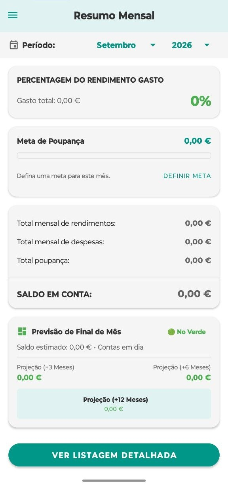 | 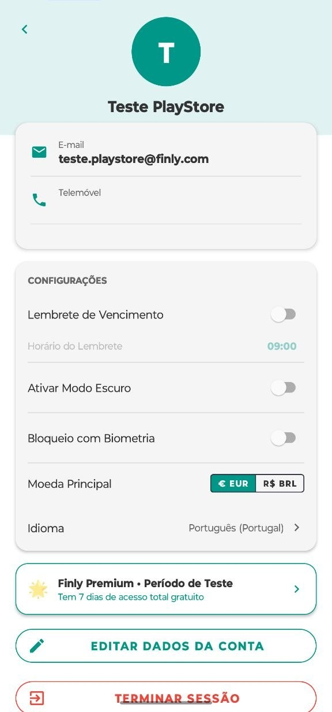 | 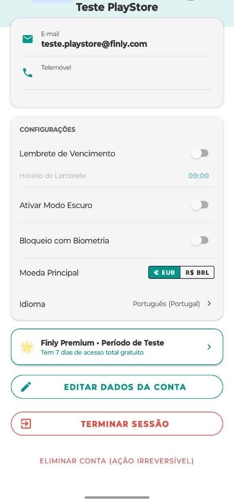 |

### 📝 Gestão & Adição de Transações
| 06. Listagem Detalhada | 07. Nova Transação | 08. Evolução Anual |
| :---: | :---: | :---: |
| 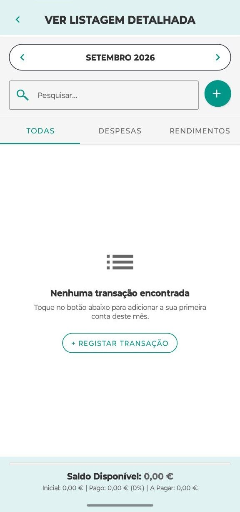 | 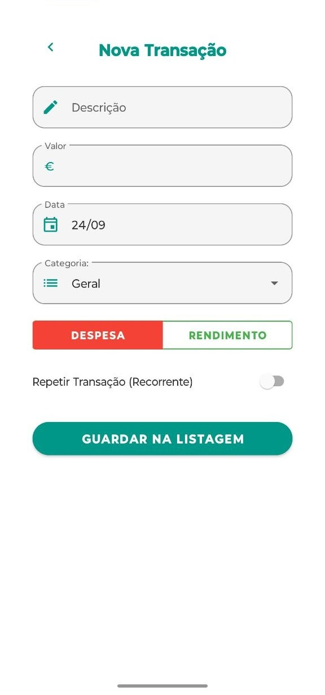 | 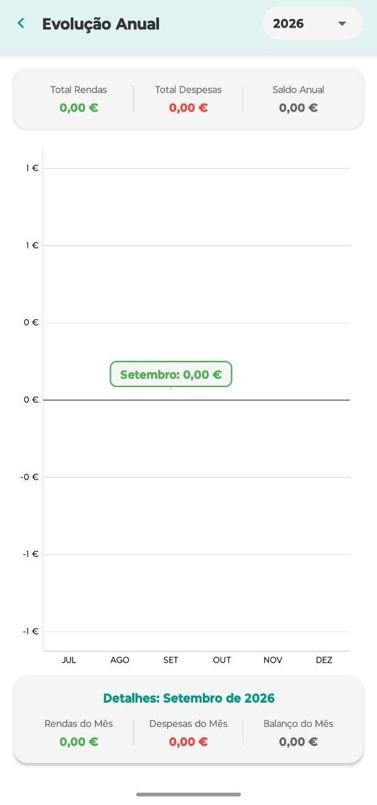 |

### 🎯 Tetos, Relatórios & Backup
| 09. Tetos por Categoria | 10. Relatórios PDF & CSV | 11. Edição de Perfil | 12. Backup & Segurança |
| :---: | :---: | :---: | :---: |
| 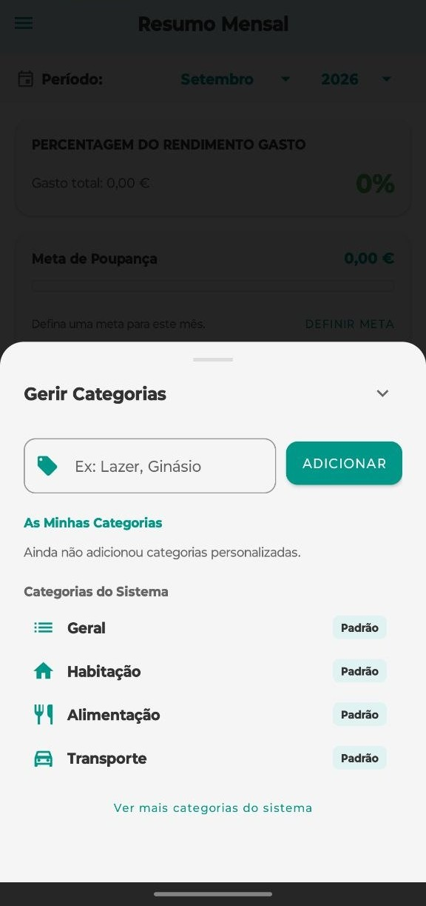 | 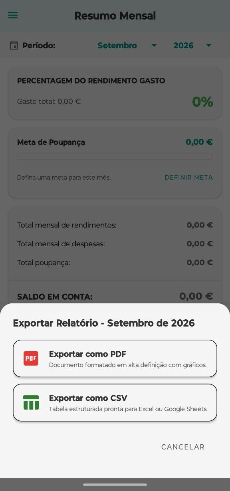 | 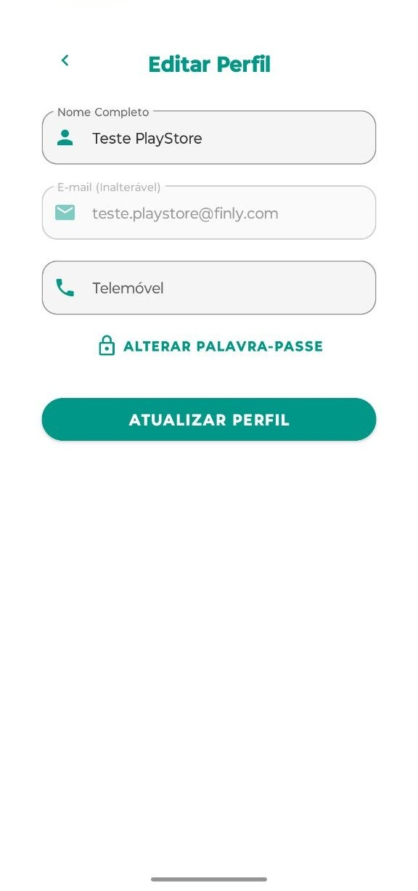 | 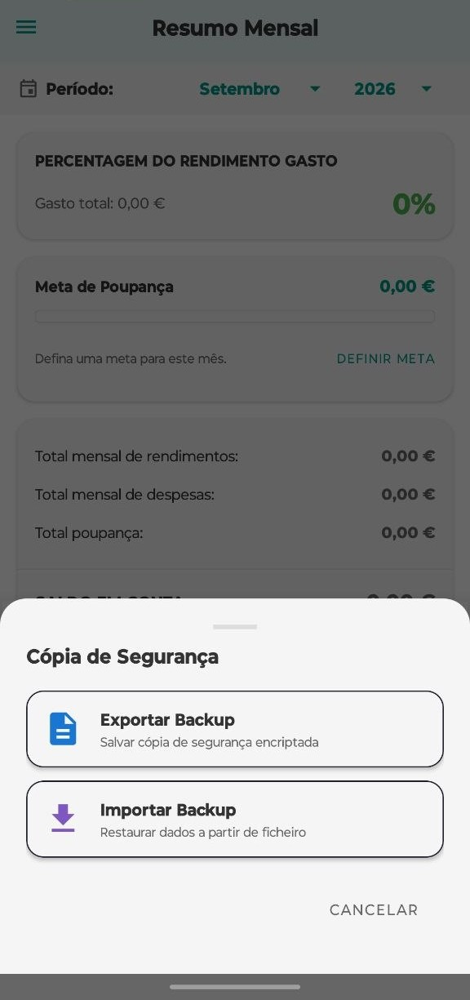 |

### ⚙️ Detalhes & Edição de Itens
| 13. Detalhes da Transação | 14. Editar Transação | 15. Diálogo Recorrência | 16. Diálogo Eliminar |
| :---: | :---: | :---: | :---: |
| 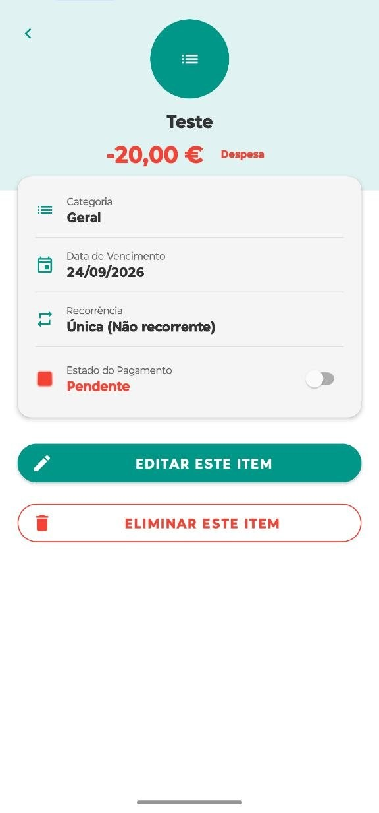 | 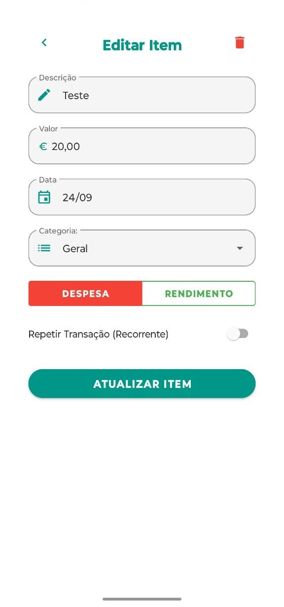 | 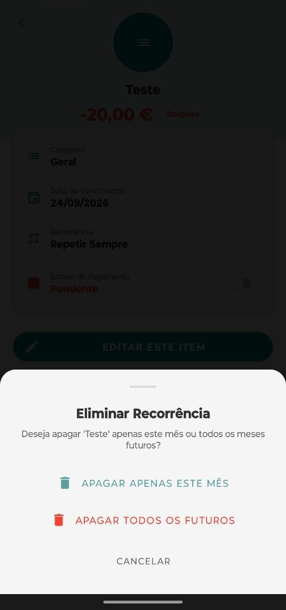 | 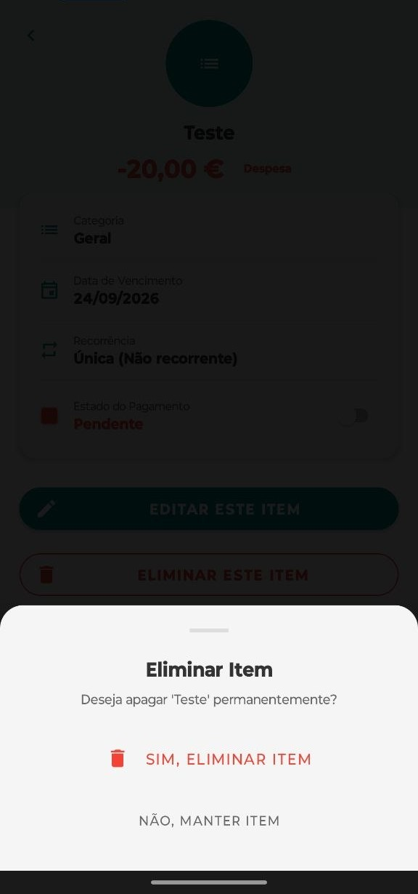 |

---

## 🛠️ Tecnologias Utilizadas

*   **Linguagem:** [Kotlin](https://kotlinlang.org/) (100% Nativo)
*   **Arquitetura:** MVVM + Repository Pattern com Coroutines & Kotlin Flow.
*   **Base de Dados Local:** [Room Database](https://developer.android.com/training/data-storage/room) para persistência offline rápida.
*   **Backend & Nuvem:** [Firebase](https://firebase.google.com/) (Firestore em tempo real, Firebase Authentication).
*   **Encriptação & Backup:** Criptografia AES em ficheiros `.finly`.
*   **Internacionalização:** Jetpack AppCompat Per-App Language Preferences (`LocaleListCompat`, `locales_config.xml`).
*   **Notificações & Background:** [WorkManager](https://developer.android.com/topic/libraries/architecture/workmanager) para agendamento de tarefas e notificações nativas.
*   **Segurança & Biometria:** [AndroidX Biometric API](https://developer.android.com/training/sign-in/biometric-auth) para autenticação por impressão digital e PIN.
*   **Gráficos & PDFs:** [MPAndroidChart](https://github.com/PhilJay/MPAndroidChart) e API nativa `PdfDocument` com renderização vetorial.
*   **UI/UX:** Material Design 3, View Binding, Edge-to-Edge API, LayoutAnimation, NestedScrollView em modais/BottomSheets.

---

## 🚀 Como Executar o Projeto

1.  Clone este repositório:
    ```bash
    git clone https://github.com/Jrodrygues/Finly-Gestao-Financeira.git
    ```
2.  Abra o projeto no **Android Studio**.
3.  Configure o seu ficheiro `google-services.json` do Firebase na pasta `app/`.
4.  Sincronize o Gradle e execute no seu emulador ou dispositivo físico.

---

## 📄 Licença

Este projeto está sob a licença MIT - veja o ficheiro [LICENSE](LICENSE) para detalhes.

---

## ✍️ Autor

Desenvolvido com ❤️ por **Jesse Rodrigues**. 

---
*Finly - O seu futuro financeiro começa aqui.*
