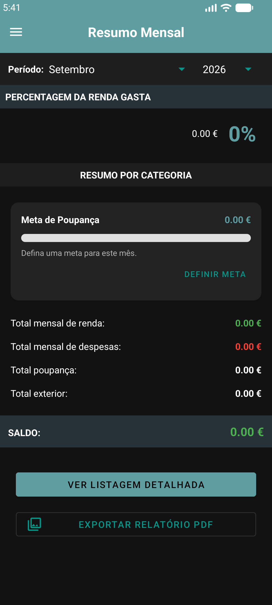

# Finly - Gestão Financeira Inteligente 🚀💰

**Finly** é uma aplicação Android moderna e intuitiva desenhada para ajudar utilizadores a ter um controlo total sobre as suas finanças pessoais. Com um design premium e funcionalidades de sincronização em nuvem, o Finly transforma a gestão de gastos numa experiência simples e organizada.

---

## ✨ Funcionalidades Principais

*   **📊 Dashboards Visuais:** Gráficos circulares (Donut) para resumo mensal e gráficos de barras para evolução anual de rendas e despesas.
*   **🔄 Sincronização em Tempo Real:** Integração total com **Firebase Firestore**, garantindo que os seus dados estejam seguros e acessíveis em qualquer dispositivo.
*   **🔐 Autenticação Segura:** Sistema de login e registo robusto via Firebase Auth, incluindo modo "Entrar como Convidado" para uso local.
*   **📅 Recorrência Inteligente:** Registe contas fixas uma única vez e o sistema gera automaticamente as transações para os meses futuros.
*   **📈 Evolução Anual:** Painel exclusivo para comparar o desempenho financeiro mês a mês ao longo do ano.
*   **📄 Exportação PDF:** Gere relatórios profissionais detalhados dos seus meses diretamente no telemóvel.
*   **🌓 Modo Escuro Nativo:** Interface totalmente adaptada para os modos Light e Dark, respeitando as definições do sistema.
*   **📱 Responsividade Total:** Desenvolvido com Material Design 3 e layouts flexíveis para qualquer tamanho de ecrã.

---

## 📸 Demonstração Visual (Screenshots)

### 🔐 Autenticação & Entrada
| Login | Registo de Conta | Modo Convidado |
| :---: | :---: | :---: |
|  |  |  |

### 📝 Gestão & Adição de Transações
| Listagem Detalhada | Nova Transação | Perfil & Definições |
| :---: | :---: | :---: |
|  |  |  |

### 📊 Dashboards & Relatórios
| Resumo com Gráfico | Lista por Categorias | Evolução Anual (Barras) |
| :---: | :---: | :---: |
|  |  |  |

### 📖 Perfil & Guia
| Editar Perfil | Guia do Utilizador | Resumo Inicial |
| :---: | :---: | :---: |
|  |  |  |

---

## 🛠️ Tecnologias Utilizadas

O projeto foi construído com as melhores práticas de desenvolvimento Android:

*   **Linguagem:** [Kotlin](https://kotlinlang.org/) (100% Nativo)
*   **Arquitetura:** MVVM (Model-View-ViewModel)
*   **Base de Dados Local:** [Room Database](https://developer.android.com/training/data-storage/room) para persistência offline.
*   **Backend & Nuvem:** [Firebase](https://firebase.google.com/) (Firestore, Auth).
*   **Gráficos:** [MPAndroidChart](https://github.com/PhilJay/MPAndroidChart) para visualizações dinâmicas.
*   **UI/UX:** Material Components, View Binding, Edge-to-Edge API.
*   **Processamento Assíncrono:** Coroutines & Flow.

---

## 🚀 Como Executar o Projeto

1.  Clone este repositório:
    ```bash
    git clone https://github.com/Jrodrygues/Finly-Gestao-Financeira.git
    ```
2.  Abra o projeto no **Android Studio**.
3.  Configure o seu ficheiro `google-services.json` do Firebase na pasta `app/`.
4.  Sincronize o Gradle e execute no seu emulador ou dispositivo físico.

---

## 📄 Licença

Este projeto está sob a licença MIT - veja o ficheiro [LICENSE](LICENSE) para detalhes.

---

## ✍️ Autor

Desenvolvido com ❤️ por **Jesse Rodrigues**. 

---
*Finly - O seu futuro financeiro começa aqui.*
